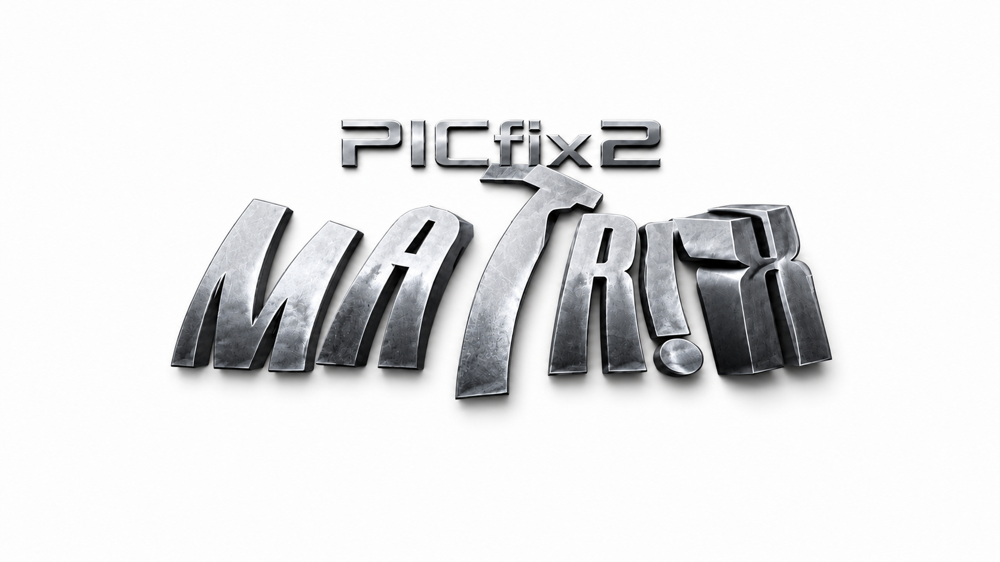

<div align="center">
  <picture>
    <source media="(prefers-color-scheme: dark)" srcset="Images/Logos/FBD-PS2-PICfix2-Dark.png">
    <source media="(prefers-color-scheme: light)" srcset="Images/Logos/FBD-PS2-PICfix2-Light.png">
    
  </picture>
</div>

# PS2 PICfix2

PICfix2 is a modernized version of the classic PlayStation 2 Matrix PICfix circuit.

The goal of this project is not to change what PICfix does. The goal is to improve how the PICfix circuit interfaces with the PS2 reset/shutdown path so the protection circuit can do its job without loading or disturbing the console’s normal reset behavior.

PICfix2 keeps the original purpose of PICfix:

> Detect a MechaCon / DVD-controller communication crash condition and force the console into shutdown/reset before the optical pickup coils can be damaged.

## Why PICfix Exists

Some PlayStation 2 models are known to suffer from a laser-killing failure condition. When the DSP / drive-control communication crashes while the DVD system is still active, the console may continue driving the tracking and focus coils.

If the console is left in this crashed state, the driver outputs can saturate and the optical pickup coils may overheat or burn.

The original Matrix PICfix was created as a simple, low-cost hardware protection circuit using a PIC12C508 microcontroller. The PIC monitors the communication between the mechanics controller and DVD controller. If the monitored signal indicates that the system has crashed, the PIC triggers a shutdown/reset condition to protect the laser assembly.

PICfix2 is based on that same idea.

## What PICfix2 Changes

The original PICfix design connects the PIC output to the console reset/shutdown path through a resistor. That works, but the PIC output is still a driven signal connected to a sensitive console control signal.

The resistor value has to be chosen carefully so the PIC can pull the line down when needed without holding the console in reset during normal operation.

PICfix2 changes the output stage.

Instead of relying on the PIC output and series resistor as the direct reset pull-down path, PICfix2 uses a 74LVC1G07 open-drain buffer to create a high-impedance, open-collector-style shutdown output.

The 74LVC1G07 output does not drive the console `/RESET` line high. It only sinks the line low when the protection circuit is active. When inactive, the output is high-impedance and stays out of the console’s normal reset/shutdown behavior.

### Original PICfix Output Concept

- PIC12C508 monitors the crash-detection signal.
- When a crash is detected, the PIC output activates.
- The PIC output pulls the console reset/shutdown signal path to ground through a resistor on the output pin of the PIC.
- Resistor value is critical because the circuit is connected directly to the console reset/shutdown signal.

### PICfix2 Output Concept

- PIC12C508 / PIC12F508 keeps the same firmware and same monitoring behavior.
- The PIC output controls a 74LVC1G07 open-drain buffer.
- A 47kΩ pull-up holds the 74LVC1G07 input high when the PIC output is inactive.
- When the 74LVC1G07 input is high, the 74LVC1G07 output is high-impedance.
- When the PIC output pulls low during a fault condition, the 74LVC1G07 output sinks the IC403 `/RESET` signal to ground.
- When inactive, the IC403 `/RESET` signal is not actively driven or loaded by PICfix2.

This makes the PICfix2 output behave like an open-collector/open-drain shutdown switch connected to the existing IC403 `/RESET` signal.

## Proof of Concept


> **Note:** This image shows a proof-of-concept test setup only.  
> It is **not** the final PICfix2 PCB or final installation method.  
> The original PICfix board is being used with an added output-interface test circuit to evaluate the planned high-impedance/open-drain shutdown approach.

## Important `/RESET` Signal Naming Note

In this project, the shutdown signal used by PICfix2 should be referred to as the IC403 `/RESET` signal.

This is not the same as every signal labeled `RST` or `/RST` elsewhere on the console. PICfix2 is specifically using the `/RESET` signal that comes from IC403.

IC403 is an IC supervisor. Its job is to monitor the console’s system voltage. If IC403 sees an invalid, unstable, or irregular voltage condition, it asserts the `/RESET` signal.

That `/RESET` signal is already part of the console’s normal control system:

- On later affected boards, the IC403 `/RESET` signal is routed into the MechaCon reset/control path.
- On earlier affected boards, the IC403 `/RESET` signal is routed into the SysControl / SysCon reset/control path, including IC402.

PICfix2 does not create a new shutdown method. It uses this existing IC403 `/RESET` signal as the means to force the console into shutdown/reset during a valid laser-protection fault condition.

Because of this, PICfix2 should be described as pulling down the IC403 `/RESET` signal, not simply pulling down a generic console `RST` or `/RST` line.

## Main Design Goal

The main goal of PICfix2 is to avoid interfering with the PS2’s existing reset/shutdown circuit.

On the affected PS2 boards, IC403 already generates a `/RESET` signal for the console. That signal is used by the MechaCon or SysControl / SysCon circuitry as part of the console’s normal reset and shutdown behavior.

PICfix2 taps into that existing IC403 `/RESET` signal and only pulls it low when a valid laser-protection shutdown event is detected.

When PICfix2 is idle, it should stay out of the way.

When PICfix2 detects the same failure condition as the original PICfix, it should pull the IC403 `/RESET` signal low and force the console to shut down/reset.

## Design Intent

PICfix2 is intended to be:

- A drop-in conceptual replacement for the original PICfix output method.
- Compatible with the original PIC12C508 firmware.
- Compatible with the PIC12F508 when used as a suitable PIC12C508 replacement.
- Electrically safer for the IC403 `/RESET` signal.
- High impedance when inactive.
- Open-drain / open-collector-style when active.
- Simple enough for hobbyists and console modders to build.
- Focused only on laser protection, not extra features.

## What PICfix2 Is Not

PICfix2 is not intended to be a new modchip.

PICfix2 is not intended to bypass copy protection.

PICfix2 is not intended to change the behavior of the original Matrix PICfix firmware.

PICfix2 is not a full laser-driver protection system. A more advanced protection circuit could monitor the coil-drive signals directly, but that would be a more involved install and would move beyond the simple purpose of the original PICfix.

## Potentially Affected Consoles

PICfix and PICfix-style protection circuits are related to a MechaCon / DSP crash condition that can potentially affect non-DECKARD PlayStation 2 consoles.

Because of that, this project should not be limited only to a small list of tested board revisions. The better way to describe the scope is:

> Any non-DECKARD PS2 may potentially be affected, but the current PICfix-style solution does not work the same way on every board revision.

PICfix2 is being developed as an improvement to the original Matrix PICfix output method. Its first goal is to preserve the original PICfix purpose while making the IC403 `/RESET` signal interface safer and higher impedance.

## Board Revision Notes

| Unofficial Version | Common Model Range | Mainboard / Chassis Notes | PICfix2 Notes |
|---|---|---|---|
| v7 | SCPH-37000 / early SCPH-39000 series | GH-017 / GH-019 / G-chassis | Research / WIP — shutdown path works, but the monitored signal behavior appears different |
| v8 | SCPH-39000 series | GH-022 / G-chassis | Research / WIP — shutdown path works, but the monitored signal behavior appears different |
| v9 | SCPH-50000 series | GH-023 / H-chassis | Known PICfix-style target |
| v10 | SCPH-50000 series | GH-026 / I-chassis | Known PICfix-style target |
| v11 | SCPH-50000 series | GH-029 / J-chassis | Known PICfix-style target |
| v12 | SCPH-70000 series | GH-032 / GH-035 / K-chassis | Original Matrix PICfix target |
| v13 | SCPH-70000 series | GH-032 / GH-035 / K-chassis | Known PICfix-style target |

Board revisions and install points may vary. Always verify the exact motherboard revision before installing.

Some model numbers can share similar shells while using different motherboard revisions, so the motherboard revision should be trusted more than the outer case model number.

## Important Note About v7 / v8 Boards

v7 and v8 boards appear to behave differently from the later PICfix-compatible boards.

The PICfix can still force the console into standby on these boards. The reset/shutdown side of the circuit works, even though these revisions use a different SysControl / MechaCon-style reset arrangement.

The current problem is the signal behavior being monitored by the PICfix. On v7 / v8 systems, the DSP / drive-communication signal appears to behave differently, and the current Matrix PICfix method can trigger during PS1 disc loading.

In other words, the PICfix is capable of shutting the console down, but it may do so at the wrong time on these revisions.

Because of this, v7 and v8 should be considered research-in-progress for this project.

A separate solution is being investigated for these boards. The long-term goal is to develop a more universal protection approach that could eventually be used across affected non-DECKARD PS2 consoles, while still keeping the original purpose of PICfix:

> Protect the laser assembly from crash-related tracking/focus coil damage.

## Hardware Concept

PICfix2 uses the original PICfix logic with a revised output-driver stage.

Basic signal flow:

```text
Original monitored signal
        |
        v
PIC12C508 / PIC12F508 running Matrix PICfix firmware
        |
        v
Active-low PIC shutdown output
        |
        v
74LVC1G07 open-drain buffer input
        |
        v
74LVC1G07 open-drain output
        |
        v
IC403 /RESET signal pulled to GND only during fault condition
        |
        v
MechaCon or SysCon reset/control path forces shutdown/reset
```

The important difference is that the PIC is no longer treated as the direct pull-down device for the IC403 `/RESET` signal. Instead, the PIC controls a 74LVC1G07 open-drain buffer.

When the circuit is inactive, the 47kΩ pull-up holds the 74LVC1G07 input high. With the input high, the 74LVC1G07 output is off and presents a high-impedance state to the IC403 `/RESET` signal.

When the circuit is active, the PIC output pulls the 74LVC1G07 input low. The 74LVC1G07 output then sinks the IC403 `/RESET` signal to ground, similar to an open-collector switch.

## 74LVC1G07 Output Interface

PICfix2 v1.0 replaces the earlier PNP/NPN inverter concept with a 74LVC1G07 open-drain buffer.

This simplifies the output stage and better matches the design goal:

- The buffer output can only pull low.
- The buffer output cannot drive the IC403 `/RESET` signal high.
- The inactive output state is high-impedance.
- The console’s existing `/RESET` pull-up and reset-supervisor behavior remain in control.
- The PIC output no longer directly loads the IC403 `/RESET` signal.

### Input Pull-Up

The 74LVC1G07 input uses a 47kΩ pull-up resistor.

The purpose of this pull-up is to hold the buffer input high when the PIC output is inactive or not actively pulling low.

When the input is held high, the open-drain output of the 74LVC1G07 is high-impedance.

When the PIC pulls the input low during a fault condition, the 74LVC1G07 output pulls the IC403 `/RESET` signal low and forces the console into shutdown/reset.

### Output Behavior

| PIC / Buffer Input State | 74LVC1G07 Output State | IC403 `/RESET` Effect |
|---|---|---|
| Input high through 47kΩ pull-up | High-impedance | PICfix2 is inactive and does not load `/RESET` |
| Input low from PIC fault output | Pulls low | IC403 `/RESET` is pulled to ground |
| PIC unpowered / inactive | High-impedance, depending on board state and pull-up behavior | PICfix2 should remain out of the way |

## Concept Test PCBs

Shown below are the concept PCB designs that will be used for testing before the design is implemented into flex PCBs.

### Top Side

.png>)

### Bottom Side

.png>)

## Why Use an Open-Drain / Open-Collector-Style Output?

The original Matrix PICfix relies on the PIC output and a resistor value to interact with the console reset/shutdown path.

That means the resistor has to be low enough to allow the PIC to shut the console down, but high enough to avoid disturbing the normal reset behavior.

PICfix2 moves that job to an open-drain buffer stage.

Advantages:

- The PIC output is isolated from directly loading the IC403 `/RESET` signal.
- The inactive output state is high impedance.
- The active output state behaves like a controlled pull-down.
- The 74LVC1G07 cannot drive the console `/RESET` signal high.
- The console’s existing reset/shutdown circuit remains in control during normal operation.
- The original PICfix firmware behavior can be preserved.
- The circuit is simpler and cleaner than the earlier PNP/NPN inverter concept.

## Firmware

PICfix2 is intended to use the original Matrix PICfix firmware for the PIC12C508.

The goal is not to rewrite the crash-detection logic.

The goal is to improve the output interface so the same PIC behavior can interact with the IC403 `/RESET` signal in a cleaner way.

A PIC12F508 may also be used as a practical flash-based replacement during development, provided the firmware and configuration are programmed correctly for the selected device.

## Firmware / HEX Downloads

The original Matrix PICfix firmware files are included here for convenience.

- [Download PICfix2 Matrix HEX Files ZIP](Firmware/PICfix2_Matrix_HEX_Files.zip)

### Individual HEX Files

- [MFIX H8.HEX](Firmware/MFIX%20H8.HEX)
- [MFIX H16.HEX](Firmware/MFIX%20H16.HEX)

### Firmware Notes

`MFIX_H8.HEX` is the INHEX8 version, added for programmers that do not support INHEX16.

`MFIX_H16.HEX` is the INHEX16 version.

Use whichever format your PIC programmer supports.

## Installation Notes

Installation points are board-revision specific.

Before installing PICfix2:

- Verify the exact motherboard revision.
- Verify the correct monitored signal point for that board.
- Verify the IC403 `/RESET` signal point for that board.
- Verify the correct PIC output pin before connecting it to the 74LVC1G07 input.
- Keep wiring short.
- Route signal wires carefully.
- Avoid running long reset or monitored-signal wires across noisy areas of the board.
- Test the shutdown behavior before relying on the protection circuit.

Do not assume that all PS2 boards with the same outer shell use the same motherboard revision.

## Safety / Disclaimer

This project is experimental and intended for experienced console modders.

Incorrect installation can damage the console, optical drive, motherboard, or installed mod hardware.

PICfix2 is being developed as a laser-protection project. It does not guarantee that every laser failure condition will be prevented.

Use at your own risk.

## Project Status

PICfix2 is currently a work-in-progress hardware improvement to the original PICfix concept.

Current focus:

- Preserve original Matrix PICfix behavior.
- Improve the IC403 `/RESET` signal interface.
- Replace the low-impedance PIC/resistor output behavior with a high-impedance open-drain buffer output.
- Use the 74LVC1G07GV,125 as the current v1.0 output-interface device.
- Clarify board-revision differences.
- Investigate v7 / v8 behavior separately.
- Avoid changing the original purpose of PICfix.

## Credits / References

This project builds on the original Matrix PICfix concept and the work done by the PS2 modding community.

Credit and thanks to:

- The Matrix Team for the original PICfix concept and firmware.
- HaloSlayer255 for research into using PICfix-style protection on additional PS2 revisions.
- ModzvilleUSA for testing, documentation, and practical install information.  (ModzvilleUSA also helped me out with a proto-type board during the concept phase of this project.)
- Helder Game Tech for PICfix board work and community hardware support.
- The wider PS2 repair and modding community for continued research into MechaCon / DSP crash behavior and laser-protection methods.

## AI Assistance and Attribution Disclaimer

This project uses AI tools to help with writing, organization, documentation, research, code examples, and design planning. While I review and edit the information, some details may still be incorrect, incomplete, or outdated.

Not all ideas, code, research, methods, or technical information in this project should be credited only to me. This project may reference, build on, or be inspired by community knowledge, open-source projects, datasheets, forum posts, Discord discussions, manufacturer documentation, and the work of other developers and modders.

Credit will be given whenever a source is known. If something is missing credit or needs correction, please let me know so I can update the documentation.
